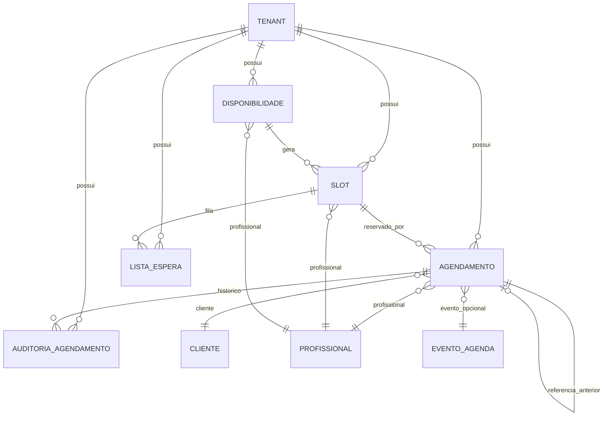
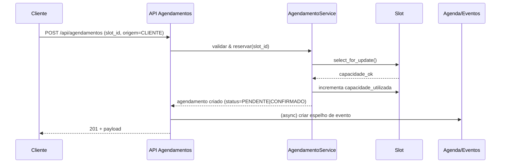
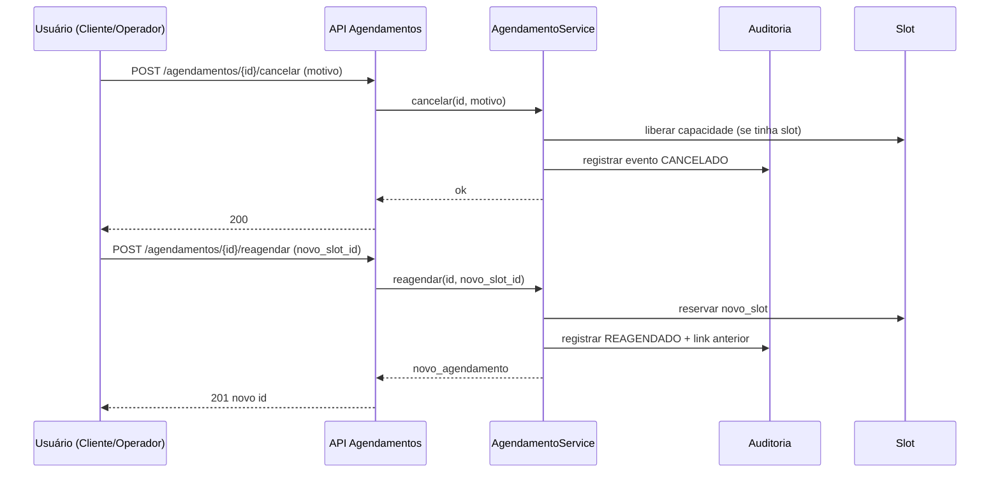

# Módulo de Agendamentos

Este documento unifica:
- Estado atual (as‑is): como está implementado hoje.
- Proposta detalhada (to‑be): visão, roadmap e evolução.

Atualizado: 2025-09-10
Nota (2025-09-10): Listagem HTML legacy integrada ao layout ultra moderno via template ponte `generic_list.html` (retrocompatível, nenhuma coluna removida). Fase 2 (FK em prontuários) CONGELADA até decisão explícita. API v2 permanece em modo scaffold (retorna vazio se flag `USE_NOVO_AGENDAMENTO` desativada).

---
## 1) Estado atual (as‑is)

### Entidades
| Modelo | Descrição | Campos Chave |
|--------|-----------|--------------|
| `Agendamento` | Reserva de horário para cliente | `cliente`, `profissional`, `data_inicio`, `status`, `servico` (antes `procedimento`) |
| `Slot` | Unidade de tempo disponível | `horario`, `profissional`, `capacidade_total`, `capacidade_utilizada` |
| `Disponibilidade` | Janela recorrente ou avulsa para geração de slots | `profissional`, `data`, `hora_inicio`, `hora_fim`, `duracao_slot_minutos` |
| `WaitlistEntry` | Entrada de lista de espera | `slot`, `cliente`, `prioridade`, `status` |
| `AuditoriaAgendamento` | Histórico de eventos/status | `agendamento`, `tipo_evento`, `de_status`, `para_status` |

### Serviços
`AgendamentoService`: criar, cancelar, concluir, checkin, reagendar, resolver pendências.
`SlotService`: gerar slots a partir de disponibilidade.
`SchedulingService` (fachada): delega para `SlotService` e `AgendamentoService` oferecendo interface unificada (compat / integração futura, métricas, tracing).
`Event Mirror` (flag `ENABLE_EVENT_MIRROR`): criação/atualização automática de `agenda.Evento` com status mapeado.
`Model Permissions Enforcement` (flag `ENABLE_AGENDAMENTOS_MODEL_PERMS`): valida permissões `view/add/change/delete` antes de permitir a ação.

### Escopo por Tenant
- Todos os modelos têm FK para `Tenant` e as APIs filtram por empresa atual via `get_current_tenant`.
- Forms limitam querysets ao tenant fornecido.

### Papéis e Permissões (como está implementado hoje)
- Superuser: acesso total a todos os recursos do módulo.
- Secretaria (grupo `AGENDAMENTOS_SECRETARIA`): acesso total no tenant (CRUD de disponibilidades e agendamentos; leitura de slots; acesso à Auditoria).
- Profissional (usuário com `is_staff=True`): acesso aos próprios dados do tenant:
  - Disponibilidades: só as suas.
  - Slots: só os seus, futuros; filtros por `data`, `profissional`, `disponivel`.
  - Agendamentos: apenas os próprios; pode cancelar/reagendar/checkin/concluir nos seus.
- Cliente (usuário não-staff): atualmente sem acesso às APIs do módulo.
- Visualizador (grupo `AGENDAMENTOS_VISUALIZAR`): acesso global somente leitura (SAFE_METHODS) nas APIs do módulo.

Observações adicionais (implementado):
- Papel “Cliente Portal” (via `clientes.AcessoCliente`): endpoints dedicados sob `/agendamentos/api/cliente/*`, com permissão específica (IsClientePortal) permitindo listagem de slots disponíveis e operações nos próprios agendamentos.
- Comando `seed_agendamentos_perms` cria/atualiza grupos padrão, incluindo `AGENDAMENTOS_VISUALIZAR` com permissão de leitura.

Observação: As permissões não usam hoje as permissões nativas do Django Admin (view/add/change/delete) para decidir acesso; a lógica se baseia em `is_staff` e no grupo `AGENDAMENTOS_SECRETARIA`.

### APIs Principais (DRF)
- `GET /agendamentos/api/disponibilidades/` – lista do tenant, escopo por papel.
- `POST /agendamentos/api/disponibilidades/{id}/gerar_slots/` – gera slots a partir da disponibilidade.
- `GET /agendamentos/api/slots/` – lista slots futuros (filtros: `profissional`, `data`, `disponivel`).
- `POST /agendamentos/api/slots/{id}/reservar/` – cria agendamento com base no slot (somente perfis autorizados).
- `POST /agendamentos/api/slots/{id}/waitlist/` – inscreve cliente na lista de espera do slot.
- `GET/POST /agendamentos/api/agendamentos/` – CRUD no escopo do papel.
- `POST /agendamentos/api/agendamentos/{id}/cancelar/` – cancela.
- `POST /agendamentos/api/agendamentos/{id}/reagendar/` – reagenda.
- `POST /agendamentos/api/agendamentos/{id}/checkin/` – check-in.
- `POST /agendamentos/api/agendamentos/{id}/concluir/` – conclui.
- `GET /agendamentos/api/agendamentos/stats/` – estatísticas agregadas por status/tempo.
- `GET /agendamentos/api/agendamentos/capacidade/` – capacidade agregada por profissional e data.
- `GET /agendamentos/api/agendamentos/auditoria/` – leitura de auditoria (somente secretaria/superuser).

Endpoints Portal do Cliente (implementado):
- `GET /agendamentos/api/cliente/slots/` – lista slots futuros com vaga; filtros por `profissional`, `data`, `servico_id` (antes `procedimento_id`; aplica competência quando flag ativa).
- `POST /agendamentos/api/cliente/slots/{id}/reservar/` – cliente reserva slot (origem=CLIENTE), com duração automática por serviço clínico (`servico.perfil_clinico.duracao_estimada`).
- `GET/POST /agendamentos/api/cliente/agendamentos/` – listar/criar agendamentos do próprio cliente.
- `POST /agendamentos/api/cliente/agendamentos/{id}/cancelar/` – cancelar próprio agendamento (regras de antecedência aplicadas).
- `POST /agendamentos/api/cliente/agendamentos/{id}/reagendar/` – reagendar (aceita `novo_slot` ou novas datas).

### Padrões nas Views
- `TenantMixin` para filtrar por empresa.
- `get_queryset()` sempre aplica `tenant`.
- `get_context_data()` injeta estatísticas para listas:
  - Agendamentos: total, confirmados, pendentes, no-show.
  - Slots: total, capacidade total, utilizados, % ocupação.
  - Disponibilidades: total, ativas, inativas, média capacidade.
  - Waitlist: total + Top3 nomes.
  - Auditoria: total + categorias (criações, cancelamentos, mudanças de estado).

### Regras de Negócio Resumidas
- Capacidade de slot não excedida: utilização limitada a `min(cap_util, cap_tot)` no cálculo para estatísticas.
- Waitlist ordenada por `prioridade, created_at`.
- Reagendamento cria novo registro mantendo histórico via auditoria.
 - Duração automática por serviço: se `servico` informado e `data_fim` ausente, calcula usando `servico.perfil_clinico.duracao_estimada`.
 - Reagendar com apenas `novo_slot`: calcula `nova_data_inicio` pelo horário do slot e `nova_data_fim` pela duração do serviço; na falta, usa `duracao_slot_minutos`.
 - Erros de regra → HTTP 400: violações de regra de negócio (ex.: falta de competência com `ENFORCE_COMPETENCIA=True`) retornam 400 (ValidationError) em `create`/`reservar`/`reagendar`.

### Diferenças em relação ao módulo `agenda` (agenda_eventos)
- `agendamentos` trata da operação clínica/serviço com `Slot`, `Disponibilidade`, `Agendamento` e `Waitlist` por tenant e profissional.
- `agenda` mantém eventos genéricos (reuniões, lembretes, etc.) e não compartilha dados com `agendamentos`.

### Matriz Feito x Faltante (as‑is vs to‑be)
- Feito (implementado):
  - Modelos: Disponibilidade, Slot, Agendamento, WaitlistEntry, AuditoriaAgendamento (com índices e ordering relevantes).
  - Serviços: SlotService (gerar slots), AgendamentoService (criar/cancelar/reagendar/checkin/concluir/resolver_pendências), concorrência com select_for_update.
  - APIs DRF: endpoints listados acima; filtros por tenant; stats e capacidade; ações custom (reservar/waitlist/cancelar/reagendar/...).
  - Permissões: superuser e grupo AGENDAMENTOS_SECRETARIA (global); profissional is_staff (escopo próprio).
  - Forms e Views HTML com estatísticas e paginação; templates integrados; flags de overbooking/waitlist.
- Faltante (backlog imediato):
  - (ENTREGUE) Endpoints para cliente final (não-staff) sob `/api/cliente/*` (filtros adicionais em evolução).
  - (ENTREGUE - FEATURE FLAG) Aderência opcional às permissões nativas do Django Admin via flag `ENABLE_AGENDAMENTOS_MODEL_PERMS`.
  - (ENTREGUE) Evitar colisão de nomes entre rotas HTML e DRF adicionando rotas duplicadas com sufixo `ui/` (`*-ui`).
  - (ENTREGUE - FEATURE FLAG) Espelhamento de eventos em `agenda.Evento` (`ENABLE_EVENT_MIRROR`).
 - Feito (complementar):
  - Relação “Profissional x Serviço” (`ProfissionalProcedimento` legado por nome; mapeado para `servico`) com validação e filtros quando `ENFORCE_COMPETENCIA=True`.
  - Papel `AGENDAMENTOS_VISUALIZAR` (somente leitura) com enforcement em DRF e ajustes de UI.
  - Reagendar com apenas `novo_slot`: cálculo automático de `nova_data_inicio`/`nova_data_fim` (procedimento ou duração do slot).
  - Mapeamento de erros de regra de negócio para HTTP 400 em `create`/`reservar`/`reagendar`.
  - Comando de seed para grupos atualizado incluindo `AGENDAMENTOS_VISUALIZAR`.

---
## 2) Proposta detalhada (to‑be)

# Módulo de Agendamentos (Proposta de Extração / Documentação Funcional)

> Status: Proposta inicial de documentação para orientar a criação do novo módulo genérico de agendamento. Nenhuma funcionalidade existente deve ser removida; somente reorganizada e evoluída de forma retrocompatível.

---
## 1. Visão Geral
O módulo de **Agendamentos** proverá uma camada genérica, reutilizável e multissetorial para:
- Disponibilidades de profissionais / prestadores de serviço.
- Geração e reserva de slots (unidades de agenda).
- Criação, atualização, consulta e cancelamento de agendamentos (compromissos) feitas por diferentes papéis (cliente, profissional, operador interno).
- Integração opcional com eventos de uma agenda unificada (notificações, calendarização externa, dashboards).

Ele nasce a partir da experiência já implementada no módulo `prontuarios` (modelos `Atendimento`, `AtendimentoDisponibilidade`, `AtendimentoSlot`) e visa **generalizar** sem quebrar os fluxos clínicos existentes.

### Princípios
1. **Não Remover**: Nenhuma função já em produção pode ser eliminada – apenas migrada ou encapsulada. 
2. **Evoluir com Camadas**: Serviços / APIs adicionais podem ser adicionados para modernizar (ex: WebSockets para disponibilidade em tempo real, waitlist, double booking control), sempre mantendo retrocompatibilidade.
3. **Dominialidade Genérica**: Termos neutros no novo módulo: `Disponibilidade`, `Slot`, `Agendamento`. O domínio clínico (procedimentos, anamnese, fotos) permanece em `prontuarios` referenciando este núcleo.
4. **Extensibilidade por Metadata**: Campos JSON para metadados específicos de verticais sem inflar o modelo base.

### 1.1 Decisão de Nomenclatura: "Agendamentos" vs "Atendimentos"

| Critério | Agendamento | Atendimento |
|----------|-------------|------------|
| Foco Semântico | Ato de reservar um horário futuro | Ato de prestar o serviço / execução em si |
| Escopo | Pré-execução (booking) | Execução + contexto operacional/assistencial |
| Neutralidade Multissetor | Alta (consultoria, manutenção, serviço externo, clínica) | Média/Baixa (forte conotação de prestação efetiva, comum em saúde / suporte) |
| Evolução | Permite separar execução em módulos especializados | Pode forçar acoplamento com dados específicos de execução |
| Colisão com Prontuário Clínico | Evita | Aumenta (confunde registro clínico vs reserva) |
| Modelos Auxiliares | Slots, Disponibilidade, Reserva | Evolução, Procedimentos, Observações, Métricas de Resultado |

Recomendação: manter o novo módulo com nome **`agendamentos`** para representar a camada genérica de gestão de reservas / compromissos. O termo **`atendimento`** permanece (ou evolui) dentro de domínios que cuidam da execução (ex.: `prontuarios.AtendimentoClinico`, futuro `servicos.AtendimentoOperacional`). Assim evitamos ambiguidade e facilitamos reuso. Caso no futuro haja necessidade de nome ainda mais neutro (ex.: `compromissos`), uma camada de alias/rotas pode ser criada sem quebra.

Resumo Ubiquitous Language:
- Agendamento = Reserva planejada de um recurso (profissional + tempo + cliente).
- Atendimento = Realização (consumo) do agendamento com resultado, registros e medições.
- Cancelar/Reagendar atua sobre Agendamento; Concluir atua sobre Atendimento.


---
## 2. Escopo Funcional
| Área | Descrição | Observações |
|------|-----------|-------------|
| Cadastro de Disponibilidades | Profissional informa janelas (data/hora início/fim, granularidade, capacidade). | Regras de sobreposição e recorrência básicas. |
| Geração de Slots | Sistema gera slots discretos a partir da disponibilidade. | Mantém slots já ocupados; idempotência garantida. |
| Reserva de Slot | Criação de Agendamento associada a slot (lock transacional). | Suporte a capacidade >1. |
| Agendamento Direto (sem slot) | Possível para eventos avulsos fora de janela pré-declarada. | Marca flag "manual". |
| Atualização de Status | Fluxo: PENDENTE → CONFIRMADO → EM_ANDAMENTO → CONCLUIDO / CANCELADO / NO_SHOW / REAGENDADO. | Mapa configurável. |
| Reagendamento | Novo agendamento + referência ao anterior; preserva histórico. | Não apaga o antigo. |
| Cancelamento | Libera capacidade do slot se aplicável. | Auditoria do motivo. |
| Origem do Agendamento | CLIENTE / PROFISSIONAL / OPERADOR / SISTEMA. | Igual ao padrão atual do prontuário. |
| Integração Agenda Unificada | Criação/atualização de `Evento` correspondente. | Opcional (feature toggle). |
| Notificações | Hooks para e-mail / push / fila. | Inicial: stub. |
| Controle de Concorrência | `select_for_update` nos slots. | Preserva lógica atual. |

---
## 3. Papéis & Permissões
| Papel | Pode criar | Pode cancelar | Pode reagendar | Pode editar disponibilidade | Observações |
|-------|-----------|---------------|----------------|----------------------------|-------------|
| Cliente | Sim (slots disponíveis) | Somente seus agendamentos | Sim (se regras de antecedência) | Não | Interface self-service. |
| Profissional (prestador) | Sim (se associado) | Sim (se participante) | Sim | Sim (suas próprias) | Derivado do módulo Funcionários (tipo/flag profissional). |
| Operador Interno / Atendimento / Secretaria | Sim (para qualquer cliente/profissional) | Sim | Sim | Sim (global, se permissão) | Papel configurado em ACL. |
| Sistema (processos automáticos) | Sim (rotinas) | Sim (ex: limpeza de pendentes expirados) | Sim | Não | Via tasks / jobs. |

---
## 4. Entidades (Modelo Conceitual)
```
Disponibilidade (profissional, data, hora_inicio, hora_fim, duracao_slot, capacidade_slot, recorrente, regra_recorrencia)
  └─< Slot (horario, capacidade_total, capacidade_utilizada, ativo)
Agendamento (cliente, profissional, slot?, data_inicio, data_fim, status, origem, procedimento?, tipo_servico?(LEGADO), metadata JSON, referencia_agendamento_anterior?)
IntegracaoAgendaEvento (FK opcional para Evento já existente) – ou campo direto evento_id
AuditoriaAgendamento (agendamento, tipo_evento, anterior->novo, timestamp, user, motivo)
ListaEspera (slot/opcional, cliente, prioridade, status)
Procedimento (modelo externo em `prontuarios.Procedimento` – referenciado pelo Agendamento)
```

### Diagrama (Mermaid)


### Campos Reutilizados do Prontuário
- `AtendimentoDisponibilidade` → `Disponibilidade`
- `AtendimentoSlot` → `Slot`
- Parte genérica de `Atendimento` → `Agendamento`
- Campos clínicos específicos (pressão, área tratada, reações) permanecem em `prontuarios.AtendimentoClinico` (novo 1–1 posterior).

---
## 5. Fluxos Principais
### 5.1 Criação por Profissional
1. Profissional abre painel de agenda → cria disponibilidade.
2. Sistema gera slots.
3. Profissional seleciona slot e agenda serviço para cliente ou deixa em aberto (slot reservado sem cliente?).

### 5.2 Criação por Cliente (Portal / App)
1. Cliente lista profissionais / serviços + slots disponíveis.
2. Seleciona slot → reserva (origem=CLIENTE).
3. Confirmação + notificação.

### 5.3 Criação por Operador (Secretaria)
1. Operador busca cliente + profissional.
2. Visualiza slots ou cria agendamento manual (fora de slot).
3. Sistema cria e registra origem=OPERADOR.

### 5.4 Cancelamento
- Atualiza status → CANCELADO.
- Libera capacidade do slot (capacidade_utilizada -= n) se era baseado em slot.
- Log em auditoria.

### 5.5 Reagendamento
- Cancela antigo (status=REAGENDADO ou CANCELADO mantendo referência).
- Cria novo agendamento com `referencia_agendamento_anterior`.

### 5.6 Integração Evento Agenda
Hook pós-save cria/atualiza evento (sincroniza título, horário, status) quando `ENABLE_EVENT_MIRROR=True`.
Chave de metadata padronizada: `evento_agenda_id` (migração automática se detectar legado `evento_id`; após a sincronização a chave antiga é removida para evitar duplicidade).
Endpoint manual de sincronização (idempotente) para correções ou criação tardia de espelho: `POST /agendamentos/api/agendamentos/{id}/sync_evento/` (disponível apenas quando o espelhamento está habilitado; cria se ausente e atualiza se divergente).

### 5.7 Conclusão / Check-in
- Transição confirmada para EM_ANDAMENTO quando iniciado.
- Ao finalizar → CONCLUIDO (dispara integrações dependentes, ex: geração de registro clínico ou faturamento).

#### Criação por Cliente


#### Cancelamento / Reagendamento


---
## 6. Regras de Negócio
| Regra | Descrição |
|-------|-----------|
| Antecedência Cancelamento | Configurável: p.ex. bloquear cancelamento pelo cliente a < 2h do início. |
| Capacidade Slot | Não exceder `capacidade_total`. Overflow gera erro transacional. |
| Slot Inativo | Agendamento não pode usar slot inativo ou lotado. |
| Sobreposição Manual | Agendamento manual (sem slot) pode ter validação opcional de conflito. |
| Reagendamento Encadeado | Cadeia deve ser navegável; máximo configurável de reencadeamentos. |
| Origem Imutável | `origem` não deve ser alterada após criação (auditoria). |
| Auditoria Obrigatória | Transições críticas (CANCELADO, REAGENDADO) precisam de motivo. |
| Duração Automática por Procedimento | Se `procedimento` informado e `data_fim` ausente, calcular usando `procedimento.duracao_estimada`. |
| Reagendar com apenas novo_slot | Quando informado apenas `novo_slot`, o sistema calcula `nova_data_inicio` pelo horário do slot e `nova_data_fim` pela duração do procedimento; na falta, usa `duracao_slot_minutos` da disponibilidade. |
| Erros de Regra → HTTP 400 | Violações de regra de negócio (ex.: falta de competência com `ENFORCE_COMPETENCIA=True`) retornam 400 (ValidationError) nas ações `create`/`reservar`/`reagendar`. |
| Intervalo Mínimo Procedimento | Bloquear criação se última sessão do mesmo procedimento para cliente/profissional estiver dentro de `procedimento.intervalo_minimo_sessoes` (minutos). |
| Pendências Clínicas | Registrar em `metadata.pendencias` (ex: anamnese, termo) se exigidas pelo procedimento; bloquear check-in até resolvidas. |

---
## 7. Integrações
| Módulo | Uso |
|--------|-----|
| Funcionários | Origem dos profissionais (FK para `Funcionario` ou `CustomUser`). |
| Clientes | Origem dos clientes (PF / PJ). |
| Agenda (existente) | Espelhamento de eventos para visualização consolidada. |
| Prontuários | Consome `Agendamento` para criar registros clínicos (Atendimento Clínico) sem duplicar lógica de agenda. |
| Notificações | Gatilhos (e-mail, push, SMS). |

---
## 8. API (Esboço de Endpoints REST / futura GraphQL)
| Método | Endpoint | Descrição |
|--------|----------|-----------|
| GET | /api/agendamentos/ | Lista filtrável (status, profissional, cliente, período). |
| POST | /api/agendamentos/ | Cria (aceita slot_id OU data_inicio/data_fim). |
| GET | /api/agendamentos/{id}/ | Detalhe. |
| PATCH | /api/agendamentos/{id}/ | Atualizações (status, notas, metadados). |
| POST | /api/agendamentos/{id}/cancelar/ | Cancelamento com motivo. |
| POST | /api/agendamentos/{id}/reagendar/ | Cria novo e referencia o antigo. |
| GET | /api/agendamentos/stats/ | Estatísticas agregadas (futuros, confirmados, no-show). |
| GET | /api/agendamentos/capacidade/ | Capacidade agregada por profissional/data. |
| GET | /api/disponibilidades/ | Lista. |
| POST | /api/disponibilidades/ | Cria janela. |
| POST | /api/disponibilidades/{id}/gerar-slots/ | Gera slots. |
| GET | /api/slots/ | Disponíveis / filtro por profissional / intervalo. |
| POST | /api/slots/{id}/reservar/ | Reserva direta (atalho). |
| POST | /api/slots/{id}/waitlist/ | Inscreve cliente na lista de espera (se habilitado). |
| POST | /api/agendamentos/{id}/checkin/ | Transição para EM_ANDAMENTO. |
| POST | /api/agendamentos/{id}/concluir/ | Transição para CONCLUIDO. |

Campos sugeridos Agendamento (payload):
```
{
  "cliente_id": 123,
  "profissional_id": 45,
  "slot_id": 678,        // opcional se data_inicio/data_fim presentes
  "data_inicio": "2025-08-22T14:00:00Z",
  "data_fim": "2025-08-22T14:30:00Z",
  "origem": "CLIENTE",
  "tipo_servico": "PROCEDIMENTO|CONSULTA|...",
  "metadata": {"canal":"web","observacao":"primeira consulta"}
}
```

Retrocompatibilidade: endpoints atuais de `prontuarios` continuam respondendo; internamente passam a chamar serviços do novo módulo após migração.

### 8.1 Auditoria
Endpoint dedicado (somente leitura, restrito a superuser ou grupo `AGENDAMENTOS_SECRETARIA`):

| Método | Endpoint | Descrição |
|--------|----------|-----------|
| GET | /api/agendamentos/auditoria/ | Listar eventos (paginado). |
| GET | /api/agendamentos/auditoria/{id}/ | Detalhe de evento. |

Filtro recomendado: por `agendamento`, intervalo de datas, `tipo_evento`.

### 8.2 API v2 (Mínimo Atual)
Status: Scaffold funcional para listagem, detalhe, criação básica. Mantém retrocompatibilidade.

Endpoints já expostos (prefixo `/api/v2/agendamentos/` via `AgendamentoV2ViewSet`):
- GET /api/v2/agendamentos/ (lista paginada DRF)
- GET /api/v2/agendamentos/{id}/ (detalhe)
- POST /api/v2/agendamentos/ (criação)
- GET /api/v2/agendamentos/stats/
- GET /api/v2/agendamentos/capacidade/

Observações:
- Ações (cancelar, reagendar, checkin, concluir, resolver_pendencias, sync_evento) ainda NÃO possuem rota diferenciada v2; utilizam as rotas v1.
- Quando `USE_NOVO_AGENDAMENTO=False` o queryset retorna vazio (feature toggle de adoção).
- Serializer de criação (v2) permite omitir `data_inicio` e `data_fim` se `slot` for informado; nesses casos os horários são auto-preenchidos: `data_inicio = slot.horario`; `data_fim = slot.horario + duracao_slot_minutos` (fallback 30m se indisponível).
- Erros de validação retornam estrutura `{ "detail": "mensagem" }` para o caso de ausência de slot e datas.

Campos (List):
```
{
  "id": int,
  "status": str,
  "origem": str,
  "data_inicio": datetime,
  "data_fim": datetime,
  "cliente": {"id": int, "nome": str}|null,
  "profissional": {"id": int, "nome": str}|null,
  "procedimento": {"id": int, "nome": str}|null,
  "slot": {"id": int, "horario": datetime, "cap_total": int, "cap_usada": int}|null,
  "metadata": { ... }
}
```

Campos adicionais (Detail):
```
{
  ...campos_list,
  "auditoria": [ {"id": int, "tipo": str, "de": str|null, "para": str|null, "ts": datetime, "user": str|null}, ... ]
}
```

Payload de criação (POST):
```
// Via slot (datas omitidas)
{
  "cliente": <id>,
  "profissional": <id>,
  "slot": <id>,
  "origem": "PROFISSIONAL",
  "metadata": {"canal": "slot"}
}

// Manual (sem slot) – datas obrigatórias
{
  "cliente": <id>,
  "profissional": <id>,
  "data_inicio": "2025-09-10T14:00:00Z",
  "data_fim": "2025-09-10T14:30:00Z",
  "origem": "PROFISSIONAL",
  "metadata": {"canal": "manual"}
}
```

Resposta de criação (201) utiliza serializer de detalhe (inclui `id`, `auditoria` inicial vazia):
```
{
  "id": 123,
  "status": "PENDENTE",
  "origem": "PROFISSIONAL",
  "data_inicio": "...",
  "data_fim": "...",
  "cliente": {"id": 10, "nome": "Cliente X"},
  "profissional": {"id": 5, "nome": "Profissional Y"},
  "procedimento": null,
  "slot": {"id": 77, "horario": "...", "cap_total":1, "cap_usada":0},
  "metadata": {"canal":"slot"},
  "auditoria": []
}
```

Plano Próximo (não implementado ainda):
- Rotas v2 específicas para ações (`/api/v2/agendamentos/{id}/cancelar/`, etc.).
- Filtro de listagem adicional (status, profissional, cliente) em formato consistente.
- Normalização opcional de campos de metadados (whitelist) para evitar vazamento de chaves internas.

Cobertura de Testes v2 (atual):

| Cenário | Teste |
|---------|-------|
| Lista vazia com flag off | ApiV2AgendamentoFlagOffTest.test_list_v2_vazio |
| Lista populada flag on | ApiV2AgendamentoFlagOnTest.test_list_v2_populado |
| Detail inclui auditoria | ApiV2AgendamentoSerializersTest.test_detail_v2_serializer_includes_auditoria |
| Create manual (datas) | ApiV2AgendamentoSerializersTest.test_create_v2 |
| Create via slot (auto datas) | ApiV2AgendamentoCreateSlotAndValidationTest.test_create_via_slot |
| Validação ausência slot/datas | ApiV2AgendamentoCreateSlotAndValidationTest.test_validation_error_sem_slot_e_datas |

Gap Remanescente: sem testes para stats/capacidade v2 e sem teste de erro de service (ex: overbooking) ainda.

---
## 9. Auditoria & Log
- Tabela / stream `AuditoriaAgendamento` captura: agendamento_id, user_id (ou system), tipo_evento, de_status, para_status, timestamp, motivo, diff (JSON opcional).
- Suporta reconciliação e relatórios de operação.
- API protegida por permissão específica (grupo `AGENDAMENTOS_SECRETARIA` ou superuser) para evitar exposição de motivos sensíveis de cancelamento.
 - Campo `diff` atualmente inclui mudanças de procedimento (ex: `{ "procedimento": {"old": 12, "new": 34} }`). Futuro: horários, profissional, metadados críticos.

---
## 10. Extensibilidade / Feature Flags
| Feature | Flag | Observação |
|---------|------|------------|
| Eventos Agenda | ENABLE_EVENT_MIRROR | Desligável para clientes que não usam calendário unificado. |
| Lista de Espera | ENABLE_WAITLIST | Adiciona endpoints de inscrição e promoção automática. |
| Overbooking Controlado | ENABLE_CONTROLLED_OVERBOOK | Permite 1 slot extra com justificativa. |
| Notificação Push | ENABLE_PUSH_NOTIFICATIONS | Integração FCM / APNS. |
| Competência Profissional×Procedimento | ENFORCE_COMPETENCIA | Quando True, restringe criação e listagem por competência (`ProfissionalProcedimento`). |
| Enforcement Permissões de Modelo | ENABLE_AGENDAMENTOS_MODEL_PERMS | Quando True valida permissões Django (`view/add/change/delete`) antes de ações; quando False usa lógica atual por papéis. |
| Versão de API v2 (scaffold) | USE_NOVO_AGENDAMENTO | Quando False, rota `/api/v2/agendamentos/` responde vazio; usada para testes de adoção gradual. |

### 10.4 Observabilidade / Métricas
Counters Prometheus na fachada (`SchedulingService`): criar, cancelar, reagendar, checkin, concluir, reservar_slot, waitlist, sync_evento (requer `prometheus_client`). São no-op se a lib não estiver instalada.
Chave de metadata do espelho: `evento_agenda_id` (com migração automática a partir de `evento_id`).
Endpoint manual de sincronização: `POST /agendamentos/api/agendamentos/{id}/sync_evento/`.
Histograms implementados: criação, cancelamento, reagendamento (latência em segundos).
Gauges opcionais (ativados via flag `ENABLE_CAPACITY_GAUGES`):
 - `ag_slots_capacidade_total{profissional_id}` – soma da capacidade total de slots ativos hoje + amanhã.
 - `ag_slots_capacidade_utilizada{profissional_id}` – soma da capacidade já utilizada no mesmo recorte.
Cardinalidade controlada: apenas dois dias e único label (`profissional_id`). Atualizados em: gerar_slots, reservar_slot, cancelamento que libera capacidade, promoção de waitlist.

Novo counter de migração de metadata de evento:
 - `ag_evento_metadata_migracoes_total` – incrementa quando uma chave legado `evento_id` é migrada (primeira vez) para `evento_agenda_id`.

Counters adicionais de erros (validação/regra de negócio):
 - `ag_agendamentos_criacao_erros_total`
 - `ag_agendamentos_cancelamento_erros_total`
 - `ag_agendamentos_reagendamento_erros_total`
 - `ag_agendamentos_checkin_erros_total`
 - `ag_agendamentos_conclusao_erros_total`

Caching leve (in-memory/backend configurado Django Cache Framework):
 - Listagens de Slots (`SlotViewSet`, `ClienteSlotViewSet`) e Disponibilidades armazenam somente a lista de IDs filtrados por tenant e parâmetros chave.
 - TTLs atuais (curtos, para aliviar picos): Slots operador 15s, Slots cliente 20s, Disponibilidades 30s.
 - Invalidação: bump de "versão" (`ag_slots_cache_version`) ao gerar slots, reservar, cancelar (liberando capacidade) ou promover waitlist. A chave de cache inclui a versão, evitando varreduras para invalidar.
 - Estratégia deliberadamente simples (cache de IDs) para evitar serialização pesada e manter coerência de permissões (escopo de usuário aplicado após hit de cache quando necessário).

Boas práticas / Ajustes futuros:
 - Expor TTLs via settings (`AG_SLOTS_CACHE_TTL`, etc.) se precisar tunar por ambiente.
 - Adicionar gauge de taxa de acerto de cache (ex: counters internos) caso otimização adicional seja necessária.
 - Agregar gauges de capacidade por data agregada (sem label profissional) para visão macro (avaliar utilidade vs cardinalidade).

Exemplo (trecho) de `/metrics` após algumas operações:
```
ag_agendamentos_criados_total 7
ag_agendamentos_cancelados_total 1
ag_agendamentos_reagendados_total 2
ag_agendamentos_checkin_total 3
ag_agendamentos_concluidos_total 1
ag_slots_reservados_total 9
ag_waitlist_inscricoes_total 0
ag_evento_sync_total 5
ag_evento_metadata_migracoes_total 2
ag_slots_capacidade_total{profissional_id="42"} 16
ag_slots_capacidade_utilizada{profissional_id="42"} 9
```

Sugestão futura (não implementado):
- Histogram `ag_agendamento_criacao_latency_seconds` (labels opcionais: origem, possui_procedimento) para acompanhar p95.
- Gauge `ag_slots_capacidade_disponivel` com cardinalidade controlada (talvez agregado por profissional+data) calculado async.

#### Troubleshooting Espelhamento de Eventos
| Sintoma | Causa Provável | Ação |
|--------|----------------|------|
| Evento não aparece no calendário | Flag `ENABLE_EVENT_MIRROR` desativada | Ativar flag e usar endpoint `sync_evento` |
| Evento não atualiza horário | Falha silenciosa em `_mirror_evento` (ex: exceção em save) | Ver logs; executar `sync_evento` manual e checar permissões no modelo `Evento` |
| Duplicatas de evento | Versões antigas usavam `evento_id` e falharam em migrar | Confirmar metadata contém apenas `evento_agenda_id`; rodar `sync_evento` |
| Chave legado `evento_id` ainda presente | Sincronização ainda não executada após atualização | Chamar endpoint `sync_evento`; a rotina removerá `evento_id` e manterá apenas `evento_agenda_id` |
| Counter `ag_evento_sync_total` não incrementa | Biblioteca Prometheus ausente | Instalar `prometheus_client` e reiniciar app |
| Status divergente (ex: CANCELADO mas evento mostra pendente) | Mapeamento de status incompleto em versão anterior | Garantir atualização para versão com `_map_status_evento` atual e chamar `sync_evento` |

### 10.1 Tarefas Assíncronas / Jobs
| Tarefa | Agendamento | Descrição |
|--------|-------------|-----------|
| marcar_no_show_agendamentos | A cada N minutos (Celery Beat) | Marca agendamentos PENDENTE já iniciados como NO_SHOW (grace configurable). |

### 10.2 Comandos de Management
| Comando | Uso | Principais Args |
|---------|-----|-----------------|
| python manage.py backfill_agendamentos | Gera agendamentos/slots a partir de dados legados | --limit, --dry-run, --seed-perms |
| python manage.py rollback_agendamentos_beta | Remove dados criados pelo novo módulo (rollback seguro) | --confirm |
| python manage.py seed_agendamentos_perms | Cria grupos e permissões padrão | (nenhum) – inclui `AGENDAMENTOS_VISUALIZAR` (view only) |

### 10.3 Matriz de Notificações (Atual)
| Evento | Para Profissional | Para Cliente | Canal Impl. | Observações |
|--------|-------------------|-------------|-------------|-------------|
| CRIACAO | Sim | Sim | criar_notificacao (stub) | Status inicial depende da origem. |
| CANCELAMENTO | Sim | Sim | criar_notificacao | Inclui motivo. |
| REAGENDAMENTO | Sim | Sim | criar_notificacao | Mensagem referencia agendamento anterior. |
| NO_SHOW_AUTO | Sim | Sim | criar_notificacao | Gerado por tarefa periódica. |
| CHECKIN | Sim (configurável) | Não (opcional) | criar_notificacao (stub) | Pode gerar aviso de início / presença. |
| CONCLUSAO | Potencial | Sim | (futuro) | Pode disparar follow-up. |
| WAITLIST_PROMOCAO | Sim | Sim | criar_notificacao | Promoção automática após cancelamento libera vaga. |

Evoluções futuras: template configurável, multi-canal (e-mail/SMS/push), preferências por usuário.

---
## 11. Migração Gradual (Plano Alto Nível)

Atualização 2025-09-10 (implementado):
Foram adicionados counters de erro / promoção e histogramas de latência (criação, cancelamento, reagendamento):
```
ag_slots_reserva_erros_total
ag_waitlist_promocoes_total
ag_evento_mirror_falhas_total
ag_agendamento_criacao_latency_seconds_bucket / _count / _sum
ag_agendamento_cancelamento_latency_seconds_bucket / _count / _sum
ag_agendamento_reagendamento_latency_seconds_bucket / _count / _sum
```
Os histogramas usam buckets padrão do `prometheus_client` (expondo também `_created` em alguns setups) e medem apenas a execução interna do service.
1. Criar app `agendamentos` com modelos novos (sem remover os antigos). (Concluído: núcleo + waitlist + procedimento integrado) + comando `audit_tipo_servico` para inventário legado.
2. Implementar serviços adaptadores: `AgendamentoService` mapeando chamadas antigas para novas.
3. Preencher dados (script ETL): copiar registros existentes (`Atendimento` → `Agendamento`) mantendo referência cruzada.
4. Ajustar `prontuarios.Atendimento` para conter FK para `Agendamento` (fase de transição) ou converter para modelo clínico especializado.
5. Atualizar views / APIs para ler preferencialmente do novo núcleo quando presente.
6. Monitorar logs / métricas → cortar dependência direta dos antigos após estabilização.
7. Descontinuar apenas o código morto, mantendo endpoints legados enquanto necessário.

> Regra rígida: *Não apagar modelos ou campos atuais até confirmação de 100% de cobertura e aceite. Remoção tardia somente em versão maior.*

Critérios para remoção de `tipo_servico`:
- Comando `python manage.py audit_tipo_servico` retorna 0 agendamentos sem procedimento por 14 dias consecutivos.
- Nenhum novo valor distinto registrado em `tipo_servico` nesse período.
- Aprovação QA + stakeholders.

### 11.1 Checklist Detalhado de Migração

#### Preparação
- [ ] Mapear todos os pontos de uso de `Atendimento`, `AtendimentoDisponibilidade`, `AtendimentoSlot` (views, serializers, services, templates, tasks, signals).
- [ ] Levantar volume de dados e janelas de manutenção aceitáveis.
- [ ] Definir métricas de verificação pós-migração (contagens por status / profissional / dia).
- [x] Criar feature flag `USE_NOVO_AGENDAMENTO` (implementada; controla resposta da API v2 retornando vazio quando `False`).

#### Fase 1 – Introdução do Novo App
- [x] Criar app `agendamentos` com modelos: `Disponibilidade`, `Slot`, `Agendamento`, `AuditoriaAgendamento`.
- [x] Adicionar modelo `WaitlistEntry` (lista de espera básica) condicionado a flag.
- [x] Promoção automática de waitlist em cancelamento.
- [x] FK `procedimento` incorporada ao Agendamento (com backfill de `tipo_servico`).
- [x] Implementar serviços: `SlotService`, `AgendamentoService` contendo a lógica de criação/cancelamento/reagendamento (serviço "SchedulingService" não necessário).
- [ ] Criar serializers e endpoints paralelos (`/api/v2/agendamentos/...`).
  - (Scaffold criado: `AgendamentoV2ViewSet`, flag `USE_NOVO_AGENDAMENTO` controla exposição de dados.)
- [x] Adicionar testes base (reservar, cancelamento, reagendamento, competência, permissões read-only, portal do cliente). (Cobertura de `gerar_slots`/concorrência pode ser expandida.)

---
## 17. Changelog Recente
- Adicionado papel `AGENDAMENTOS_VISUALIZAR` (somente leitura) com enforcement em APIs.
- Implementada relação `ProfissionalProcedimento` com validação (flag `ENFORCE_COMPETENCIA`) e filtro na listagem de slots.
- `AgendamentoViewSet.create`: mapeia `ValueError` para HTTP 400 (ValidationError) em violações de regra de negócio.
- `AgendamentoService.reagendar`: suporte a reagendamento informando apenas `novo_slot` (cálculo automático de datas).
- Endpoints do Portal do Cliente: `/api/cliente/slots/` e `/api/cliente/agendamentos/` (listar, reservar, cancelar, reagendar).
- Comando `seed_agendamentos_perms` atualizado para incluir o grupo de visualização.
 - Endpoint manual `POST /agendamentos/api/agendamentos/{id}/sync_evento/` para (re)sincronização de evento espelho.
 - Instrumentação de counters Prometheus na fachada (`SchedulingService`).
 - Unificação da chave de metadata para `evento_agenda_id` (migração automática de `evento_id`).
 - Flag `ENABLE_AGENDAMENTOS_MODEL_PERMS` para enforcement opcional de permissões de modelo.
- Caching leve de listagens (slots e disponibilidades) com versão e TTL curto.
- Gauges opcionais de capacidade (`ENABLE_CAPACITY_GAUGES`).
- Counter `ag_evento_metadata_migracoes_total` para monitorar progressão da limpeza de legado.

#### Fase 2 – Adaptação do Módulo Prontuários
- [ ] Adicionar FK opcional `agendamento` em `prontuarios.Atendimento` (ou criar `AtendimentoClinico`).
- [ ] Ao criar novo atendimento clínico: usar serviço novo para gerar `Agendamento` (se flag ativa) e associar.
- [ ] Manter caminho antigo se flag desativada.
- [ ] Ajustar templates para ler horários via objeto associado (`atendimento.agendamento.data_inicio`).

#### Fase 3 – Migração de Dados Históricos
- [ ] Congelar gravações (modo somente leitura rápido) ou operar incremental.
- [ ] Script ETL:
  - [ ] Para cada `Atendimento` legado sem FK: criar `Agendamento` com campos genéricos (mapear status / timestamps).
  - [ ] Mapear disponibilidade/slot: recriar `Disponibilidade` agregando por (profissional, data) quando necessário.
  - [ ] Criar slots correspondentes aos horários usados (marcando capacidade_utilizada apropriadamente).
  - [ ] Vincular `Atendimento.agendamento_id` e salvar.
- [ ] Gerar relatório de reconciliação (contagem por status antes/depois, total atendimentos vs agendamentos criados).
- [ ] Executar em ambiente de staging e validar.

#### Fase 4 – Transição Operacional
- [ ] Ligar flag `USE_NOVO_AGENDAMENTO` para subset de tenants piloto.
- [ ] Monitorar métricas e logs de erros / conflitos de slot.
- [ ] Validar auditoria e integrações (notificações, agenda).
- [ ] Expandir gradualmente a todos os tenants.

#### Fase 5 – Consolidação
- [ ] Atualizar endpoints antigos para delegar permanentemente aos serviços novos.
- [ ] Marcar modelos antigos como deprecated (docstring + warnings em signals/admin).
- [ ] Adicionar testes de regressão comparando resultados de queries antigas vs novas.

#### Fase 6 – Pós-Migração / Hardening
- [ ] Index tuning (EXPLAIN nas consultas mais pesadas).
- [ ] Introduzir caching leve para listagens de disponibilidade.
- [x] Implementar lista de espera (inscrição) e overbooking controlado (com promoção automática).
- [x] Integração Procedimento: duração automática e intervalo mínimo.
- [ ] Completar documentação técnica (diagramas atualizados, ADRs).

#### Rollback Estratégico
- [ ] Manter script reverso: se falha crítica, parar gravação no novo, reverter flag e continuar usando legado (sem perder dados – registrar delta para reprocessar depois).
- [ ] Log de divergência (agendamentos criados no novo durante piloto) exportável para reimport.

#### Critérios de Conclusão
- [ ] 100% dos novos atendimentos clínicos referenciam `Agendamento`.
- [ ] Zero criação direta em modelos legados por 14 dias.
- [ ] Métricas de performance dentro dos limites definidos.
- [ ] Aprovação formal de stakeholders.

---
## 12. Roadmap Evolutivo (Sem remover o que existe)
| Fase | Item | Benefício |
|------|------|-----------|
| F1 | Núcleo CRUD + Slots + Reserva | Base reutilizável. |
| F2 | Auditoria + Cancel/Reagenda robustos | Confiabilidade. |
| F3 | Evento Agenda + Notificações | Experiência integrada. |
| F4 | Lista de Espera + Overbooking controlado | Otimização de ocupação. |
| F5 | Painel Tempo Real (WebSocket) | Operação dinâmica. |
| F6 | Regras Avançadas (buffers, bloqueios, SLA) | Refinamento operacional. |
| F7 | Exposição GraphQL | Flexibilidade para front-ends múltiplos. |

Cada fase adiciona; nenhuma remove comportamento pré-existente.

---
## 13. Riscos & Mitigações
| Risco | Mitigação |
|-------|-----------|
| Duplicação de lógica durante transição | Serviço adaptador único. |
| Inconsistência entre modelos antigo e novo | Jobs de reconciliação + checagens de integridade. |
| Quebra de integrações externas | Manter endpoints antigos; versionamento v2 para novos. |
| Performance em listagens grandes | Índices em (profissional, data_inicio), (cliente, status), paginação cursor. |

---
## 14. Métricas de Sucesso
- % de novos agendamentos já criados via novo módulo (>90% após Fase 3).
- Tempo médio de reserva (latência API).
- Taxa de erros de concorrência nos slots (<0.5%).
- NPS interno (operadores/profissionais) pós-migração.

---
## 15. Glossário
| Termo | Definição |
|-------|-----------|
| Disponibilidade | Janela declarada de atendimento de um profissional. |
| Slot | Unidade discreta derivada da disponibilidade (ex: bloco de 30 min). |
| Agendamento | Compromisso reservado entre cliente e profissional. |
| Origem | Quem gerou o agendamento (cliente/profissional/operador/sistema). |
| Reagendamento | Processo de substituição mantendo histórico. |
| Overbooking | Reserva acima da capacidade nominal do slot. |

---
## 16. Diretriz Final
Todas as melhorias propostas **acrescentam**; nenhuma funcionalidade atual será removida sem plano de depreciação formal e janela de compatibilidade. A prioridade é garantir que fluxos clínicos existentes continuem intactos enquanto o núcleo de agendamentos evolui para suportar múltiplos segmentos.

> Este documento deve ser revisado e versionado junto ao repositório. Atualizações incrementais (changelog) garantem rastreabilidade das decisões.

---
### Anexo A – Decisão 2025-09-10 (Fase 2 Congelada)
Status: APROVADA (temporária)
Escopo: Adição de FK `agendamento` em `prontuarios.Atendimento` adiada.
Motivo: Encerrar ciclo atual focado apenas em estabilização de listagem e compatibilidade de templates sem introduzir dependências cruzadas adicionais antes de revisão de dados clínicos.
Revisão planejada: Reavaliar em 30 dias ou após finalização do inventário `audit_tipo_servico` com redução de registros sem procedimento.
