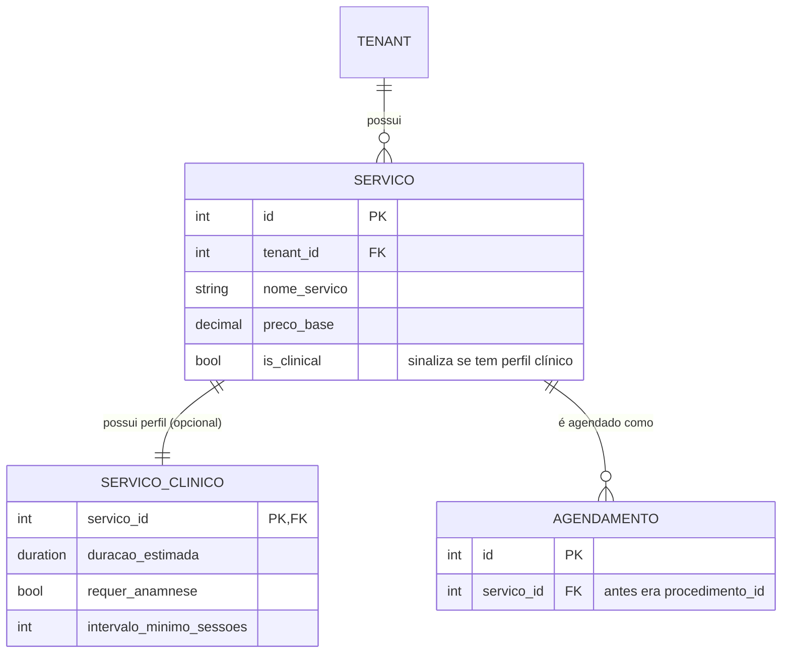

# Módulo de Serviços - Arquitetura e Migração Concluída

> **Status:** Concluído (limpeza final em andamento)
> **Data:** 2025-09-11
> **Objetivo:** Mover a definição de `Procedimento` do módulo `prontuarios` para o módulo `servicos`, criando uma estrutura genérica e extensível para gerenciar diferentes tipos de serviços em um ambiente multi-tenant.

---

## Regras de Negócio IMUTÁVEIS (ServicoClinico)

As regras do perfil clínico (`servicos.ServicoClinico`) são CONTRATO ESTÁVEL e não podem ser alteradas sem aprovação explícita do responsável de negócio. Isso inclui semântica, validações, defaults e cálculos. Mantenha a lógica clínica centralizada em `servico.perfil_clinico` (não duplique em outros módulos).

- Semântica preservada dos campos migrados do legado (ex-`Procedimento`):
    - `duracao_estimada`: duração efetiva do atendimento; usada por agenda/relatórios.
    - `intervalo_minimo_sessoes`: intervalo mínimo em dias entre sessões; usado em validações/sugestões.
    - `requer_anamnese`, `requer_termo_consentimento`, `permite_fotos_evolucao`: flags com o mesmo significado anterior.
    - `contraindicacoes`, `requisitos_pre_procedimento`, `cuidados_pos_procedimento`: textos de referência clínica; não ampliar/reduzir escopo implicitamente.
- Defaults atuais são contratuais: não altere valores padrão sem migração e aprovação formal.
- Proibido endurecer/afrouxar validações sem aprovação (ex.: mudar cálculo de `duracao_estimada` ou a política de `intervalo_minimo_sessoes`).

Política de mudanças
- Permitido: adições opcionais (novos campos com default neutro), novos serializers/views sem impacto no comportamento atual.
- Proibido: alterar semântica/validações/defaults ou remover campos/flags atuais sem aprovação registrada em CHANGELOG e docs.

---

## 1. Visão Geral e Arquitetura

### 1.1. O Problema

Atualmente, o modelo `Procedimento`, que define os serviços clínicos oferecidos (com duração, preço, requisitos, etc.), reside no módulo `prontuarios`. Isso gera dois problemas principais:

1.  **Acoplamento de Domínio:** O módulo `agendamentos` e outras partes do sistema que precisam saber sobre "serviços" são forçados a depender do módulo `prontuarios`, que deveria tratar apenas da execução clínica e do histórico do paciente/cliente.
2.  **Falta de Generalização:** O sistema possui um módulo `servicos` genérico que está subutilizado. A lógica de "serviços vendáveis" está duplicada entre `servicos.Servico` e `prontuarios.Procedimento`.

### 1.2. A Solução: Perfil Extensível (One-to-One)

Para resolver isso sem poluir o modelo base de `servicos.Servico` com campos que só fazem sentido para alguns tenants (clínicas), adotaremos o padrão de "Perfil Extensível".

1.  **`servicos.Servico` (Modelo Base):**
    *   Será o modelo canônico para **qualquer** tipo de serviço.
    *   Garantiremos que ele tenha uma `ForeignKey` para `Tenant`, tornando-o um recurso multi-tenant.
    *   Adicionaremos um campo booleano `is_clinical` para sinalizar se este serviço possui características clínicas.

2.  **`servicos.ServicoClinico` (Novo Modelo de Perfil):**
    *   Um novo modelo que conterá **apenas** os campos específicos da área de saúde (ex: `requer_anamnese`, `intervalo_minimo_sessoes`).
    *   Ele terá uma relação `OneToOneField` com `servicos.Servico`. Isso significa que para cada `Servico` que for clínico, haverá **um e apenas um** `ServicoClinico` correspondente.

### 1.3. Vinculação com o Tenant

A vinculação do `ServicoClinico` ao `Tenant` é **indireta e segura**:

- `ServicoClinico` está ligado a `Servico`.
- `Servico` está ligado a `Tenant`.
- Portanto, o acesso aos dados clínicos sempre passará pelo filtro do tenant do serviço principal. Ex: `ServicoClinico.objects.filter(servico__tenant=tenant_atual)`.

### 1.4. Diagrama da Arquitetura Proposta



---

## 2. Definição dos Modelos (Estado Atual)

### 2.1. `servicos.Servico` (Modificado)

```python
# Em servicos/models.py

class Servico(models.Model):
    # --- CAMPOS A SEREM ADICIONADOS/GARANTIDOS ---
    tenant = models.ForeignKey(
        'core.Tenant',
        on_delete=models.CASCADE,
        related_name='servicos',
        verbose_name=_('Empresa (Tenant)')
    )
    is_clinical = models.BooleanField(
        default=False,
        verbose_name=_('É um Serviço Clínico?'),
        help_text=_('Marque se este serviço tiver características de saúde/estética.')
    )

    # --- CAMPOS EXISTENTES (mapeados de Procedimento) ---
    nome_servico = models.CharField(max_length=200, verbose_name=_('Nome do Serviço')) # Mapeia de Procedimento.nome
    descricao = models.TextField(verbose_name=_('Descrição Completa')) # Mapeia de Procedimento.descricao
    preco_base = models.DecimalField(max_digits=10, decimal_places=2, verbose_name=_('Preço Base')) # Mapeia de Procedimento.valor_base
    categoria = models.ForeignKey(CategoriaServico, ...) # Mapeia de Procedimento.categoria
    ativo = models.BooleanField(default=True) # Mapeia de Procedimento.ativo

    # ... outros campos genéricos de Servico ...
```

### 2.2. `servicos.ServicoClinico` (Novo)

```python
# Em servicos/models.py

class ServicoClinico(models.Model):
    servico = models.OneToOneField(
        Servico,
        on_delete=models.CASCADE,
        primary_key=True,
        related_name='perfil_clinico',
        verbose_name=_('Serviço Base')
    )

    # --- CAMPOS MIGRADOS DE prontuarios.Procedimento ---
    duracao_estimada = models.DurationField(verbose_name=_('Duração Estimada'))
    requisitos_pre_procedimento = models.TextField(blank=True, null=True)
    contraindicacoes = models.TextField(blank=True, null=True)
    cuidados_pos_procedimento = models.TextField(blank=True, null=True)
    requer_anamnese = models.BooleanField(default=True)
    requer_termo_consentimento = models.BooleanField(default=True)
    permite_fotos_evolucao = models.BooleanField(default=True)
    intervalo_minimo_sessoes = models.PositiveIntegerField(default=7, verbose_name=_('Intervalo Mínimo entre Sessões (dias)'))

    class Meta:
        verbose_name = _('Perfil Clínico do Serviço')
        verbose_name_plural = _('Perfis Clínicos de Serviços')

    def __str__(self):
        return f"Perfil Clínico de: {self.servico.nome_servico}"
```

---

## 3. Plano de Migração (Executado)

A migração será feita em fases para minimizar riscos e garantir a integridade dos dados.

### Observabilidade de Permissões Clínicas
Após a conclusão da migração e consolidação da lógica de autorização clínica em `shared.permissions_servicos.can_schedule_clinical_service`, foi adicionada uma métrica leve para contagem de negações de agendamento clínico:

- Chave de cache: `metric:clinical_schedule_denials` (auto-expira se não incrementada por ~1h).
- Incremento ocorre somente em retornos `False` após verificar regras (superuser, staff, secretaria, cliente online elegível).
- Helper público: `get_clinical_denials_count()` para leitura rápida.

Futuro (planejado):
1. Expor via endpoint admin ou integração Prometheus (`clinical_schedule_denials_total`).
2. Opcional: adicionar label por tenant (avaliar cardinalidade antes de implementar em Prometheus; não fazer em cache in-memory simples).
3. Testes adicionais para validar não incremento em cenários de permissão concedida sob carga.

Limitações atuais: métrica é melhor-esforço e não persistida entre reinícios se o backend usar cache local (ex.: LocMemCache). Não usar para lógica de rate limit ou segurança.

### Fase 1: Preparação dos Modelos (Sem migração de dados) – CONCLUÍDO

1.  **Adicionar `tenant` e `is_clinical` a `servicos.Servico`:**
    *   Criar uma migração em `servicos` para adicionar os campos `tenant` (com `null=True` temporariamente) e `is_clinical`.
    *   Rodar um `RunPython` para preencher o `tenant` dos `Servico`s existentes (se houver) com um valor padrão ou baseado em alguma lógica.
    *   Alterar o campo `tenant` para `null=False`.

2.  **Criar o modelo `servicos.ServicoClinico`:**
    *   Adicionar o novo modelo ao `servicos/models.py`.
    *   Gerar a migração. Neste ponto, a tabela estará vazia.

### Fase 2: Migração de Dados (Data Migration) – CONCLUÍDO

1.  **Criar um script de migração de dados em `servicos`:**
    *   Este script (`RunPython`) irá iterar sobre todos os `prontuarios.Procedimento`.
    *   Para cada `Procedimento`, ele fará o seguinte **dentro de uma transação**:
        1.  Criar um novo objeto `servicos.Servico`, mapeando os campos correspondentes (`tenant`, `nome`, `descricao`, `valor_base`, `categoria`, `ativo`). Marcar `is_clinical = True`.
        2.  Criar um novo objeto `servicos.ServicoClinico`, associando-o ao `Servico` recém-criado e preenchendo os campos clínicos (`duracao_estimada`, `requer_anamnese`, etc.).
        3.  **Manter um mapa:** Guardar a relação `old_procedimento_id -> new_servico_id` em um dicionário em memória.

### Fase 3: Atualização das Relações (Foreign Keys) – CONCLUÍDO

1.  **Adicionar `ForeignKey` temporária:**
    *   Adicionar um novo campo `servico = ForeignKey('servicos.Servico', null=True)` em `agendamentos.Agendamento` e outros modelos que hoje apontam para `Procedimento`.

2.  **Preencher a nova `ForeignKey`:**
    *   Criar um novo script de migração de dados em `agendamentos`.
    *   Usando o mapa da Fase 2 (ou recriando-o), preencher o campo `agendamentos.Agendamento.servico` para cada agendamento, com base no `procedimento_id` antigo.

3.  **Trocar as chaves:**
    *   Remover a antiga `ForeignKey` (`procedimento`).
    *   Renomear a nova `ForeignKey` (`servico`) para `procedimento` ou um nome mais semântico como `servico_agendado`, e torná-la `null=False`. Esta é a parte mais delicada e requer cuidado com a ordem das operações de migração. Uma abordagem mais segura é usar um nome novo (`servico`) e adaptar o código.

### Fase 4: Adaptação do Código e Limpeza – CONCLUÍDO (com compat removida)

1.  **Atualizar o Código:**
    *   Refatorar todas as views, serializers, forms e services que usavam `prontuarios.Procedimento` para agora usarem `servicos.Servico` e, quando necessário, `servicos.Servico.perfil_clinico`.
    *   Exemplo: `agendamento.procedimento.duracao_estimada` se tornará `agendamento.servico.perfil_clinico.duracao_estimada`.

2.  **Depreciação e Remoção:**
    *   Após todos os testes passarem e a funcionalidade ser validada em ambiente de staging, o modelo `prontuarios.Procedimento` pode ser removido em uma migração final.

---

## 4. Riscos e Mitigações

| Risco | Mitigação |
|-------|-----------|
| **Inconsistência de dados durante a migração** | Usar transações atômicas no script de migração. Criar relatórios de validação (contagem de registros antes/depois). |
| **Quebra de código dependente** | Manter o modelo antigo temporariamente ou usar a técnica de "Strangler Fig" com um proxy model. Atualizar as ForeignKeys de forma faseada e testar exaustivamente. |
| **Performance em consultas complexas** | Usar `select_related('perfil_clinico')` em querysets de `Servico` para evitar queries N+1 ao acessar dados clínicos. |
| **Tempo de inatividade (downtime)** | O script de migração de dados pode ser demorado. Planejar a execução em uma janela de manutenção ou projetá-lo para ser executado em lotes (batches). |

Este plano estabelece um caminho claro e seguro para a refatoração. Podemos começar pela Fase 1 quando você estiver pronto.

---

## 5. Guia de Execução Técnica Detalhado

Este guia serve como um roteiro técnico para a execução da migração.

### Fase 1: Modificação dos Modelos e Criação de Migrações Iniciais

**Objetivo:** Preparar a estrutura do banco de dados sem mover dados.

**1. Modificar `servicos/models.py`:**

Adicione os campos `tenant` e `is_clinical` ao modelo `Servico` e crie o novo modelo `ServicoClinico`.

```python
# servicos/models.py

// ... (importações existentes)
from core.models import Tenant  # Adicionar esta importação

// ... (modelos existentes)

class Servico(models.Model):
    # --- CAMPOS A SEREM ADICIONADOS/GARANTIDOS ---
    tenant = models.ForeignKey(
        Tenant,
        on_delete=models.CASCADE,
        related_name='servicos',
        verbose_name=_('Empresa (Tenant)'),
        null=True, # Temporariamente nulo para a migração
        blank=True
    )
    is_clinical = models.BooleanField(
        default=False,
        verbose_name=_('É um Serviço Clínico?'),
        help_text=_('Marque se este serviço tiver características de saúde/estética.')
    )

    # --- CAMPOS EXISTENTES (revisar se já existem ou precisam ser adicionados) ---
    nome_servico = models.CharField(max_length=200, verbose_name=_('Nome do Serviço'))
    descricao = models.TextField(verbose_name=_('Descrição Completa'), blank=True, null=True)
    preco_base = models.DecimalField(max_digits=10, decimal_places=2, verbose_name=_('Preço Base'), default=0.0)
    categoria = models.ForeignKey(CategoriaServico, on_delete=models.SET_NULL, null=True, blank=True)
    ativo = models.BooleanField(default=True)

    # ... (resto do modelo Servico)

# --- NOVO MODELO ---
class ServicoClinico(models.Model):
    servico = models.OneToOneField(
        Servico,
        on_delete=models.CASCADE,
        primary_key=True,
        related_name='perfil_clinico',
        verbose_name=_('Serviço Base')
    )
    duracao_estimada = models.DurationField(verbose_name=_('Duração Estimada'))
    requisitos_pre_procedimento = models.TextField(blank=True, null=True)
    contraindicacoes = models.TextField(blank=True, null=True)
    cuidados_pos_procedimento = models.TextField(blank=True, null=True)
    requer_anamnese = models.BooleanField(default=True)
    requer_termo_consentimento = models.BooleanField(default=True)
    permite_fotos_evolucao = models.BooleanField(default=True)
    intervalo_minimo_sessoes = models.PositiveIntegerField(default=7, verbose_name=_('Intervalo Mínimo entre Sessões (dias)'))

    class Meta:
        verbose_name = _('Perfil Clínico do Serviço')
        verbose_name_plural = _('Perfis Clínicos de Serviços')

    def __str__(self):
        return f"Perfil Clínico de: {self.servico.nome_servico}"

```

**2. Gerar a migração para `servicos`:**

```bash
python manage.py makemigrations servicos
```

Isso criará um novo arquivo de migração em `servicos/migrations/`.

### Fase 2: Migração de Dados

**Objetivo:** Mover os dados de `prontuarios.Procedimento` para `servicos.Servico` e `servicos.ServicoClinico`.

**1. Criar um arquivo de migração de dados vazio:**

```bash
python manage.py makemigrations --empty servicos --name migrate_procedimentos_to_servicos
```

**2. Editar o arquivo de migração gerado (`servicos/migrations/XXXX_migrate_procedimentos_to_servicos.py`):**

```python
# Generated by Django X.X on YYYY-MM-DD HH:MM

from django.db import migrations
from django.db.models import F

def migrate_data(apps, schema_editor):
    """
    Migra dados de prontuarios.Procedimento para servicos.Servico e servicos.ServicoClinico.
    """
    Procedimento = apps.get_model('prontuarios', 'Procedimento')
    Servico = apps.get_model('servicos', 'Servico')
    ServicoClinico = apps.get_model('servicos', 'ServicoClinico')
    Tenant = apps.get_model('core', 'Tenant')

    # Dicionário para mapear o ID antigo para o novo objeto de serviço
    # Usado para atualizar ForeignKeys posteriormente.
    # Este mapa será salvo em um arquivo temporário para ser usado por outras migrações.
    import json
    procedimento_to_servico_map = {}

    # Assumindo que existe um tenant padrão ou uma lógica para determinar o tenant.
    # Se cada procedimento já tem uma FK para tenant, use-a.
    # Se não, defina um tenant padrão. Aqui, pegamos o primeiro, o que é uma simplificação.
    # O ideal é ter uma lógica de negócio para associar o tenant correto.
    default_tenant = Tenant.objects.first()
    if not default_tenant:
        # Se não houver tenants, a migração não pode continuar.
        # Você pode querer criar um tenant padrão aqui se fizer sentido.
        raise Exception("Nenhum Tenant encontrado. A migração de serviços não pode ser concluída.")

    for procedimento in Procedimento.objects.all():
        # 1. Criar o Servico base
        servico_obj = Servico.objects.create(
            tenant=procedimento.tenant if hasattr(procedimento, 'tenant') else default_tenant,
            is_clinical=True,
            nome_servico=procedimento.nome,
            descricao=procedimento.descricao,
            preco_base=procedimento.valor_base,
            categoria=procedimento.categoria, # Assumindo que a FK é compatível
            ativo=procedimento.ativo
        )

        # 2. Criar o perfil clínico
        ServicoClinico.objects.create(
            servico=servico_obj,
            duracao_estimada=procedimento.duracao_estimada,
            requisitos_pre_procedimento=procedimento.requisitos_pre_procedimento,
            contraindicacoes=procedimento.contraindicacoes,
            cuidados_pos_procedimento=procedimento.cuidados_pos_procedimento,
            requer_anamnese=procedimento.requer_anamnese,
            requer_termo_consentimento=procedimento.requer_termo_consentimento,
            permite_fotos_evolucao=procedimento.permite_fotos_evolucao,
            intervalo_minimo_sessoes=procedimento.intervalo_minimo_sessoes
        )

        # 3. Salvar o mapeamento
        procedimento_to_servico_map[procedimento.id] = servico_obj.id

    # Salvar o mapa em um arquivo para a próxima fase
    with open('procedimento_servico_map.json', 'w') as f:
        json.dump(procedimento_to_servico_map, f)


class Migration(migrations.Migration):

    dependencies = [
        ('servicos', 'XXXX_previous_migration'), # Altere para a migração anterior de 'servicos'
        ('prontuarios', 'YYYY_latest_prontuarios_migration'), # Garante que o modelo Procedimento está disponível
        ('core', 'ZZZZ_latest_core_migration'), # Garante que o modelo Tenant está disponível
    ]

    operations = [
        migrations.RunPython(migrate_data),
    ]
```

### Fase 3: Atualização das Chaves Estrangeiras (Foreign Keys)

**Objetivo:** Apontar todos os modelos que se relacionavam com `Procedimento` para o novo modelo `Servico`.

**1. Identificar modelos afetados:**
   - `agendamentos.Agendamento`
   - `agendamentos.Profissional_Procedimento`
   - `prontuarios.Atendimento`
   - `prontuarios.Anamnese`
   - (Verificar outros com uma busca global por `ForeignKey('prontuarios.Procedimento')`)

**2. Para cada app afetado (ex: `agendamentos`), criar uma migração:**

   a. **Adicionar a nova FK (nullable):**
      - Em `agendamentos/models.py`, adicione `servico = models.ForeignKey('servicos.Servico', on_delete=models.SET_NULL, null=True, blank=True)`.
      - Rode `python manage.py makemigrations agendamentos`.

   b. **Criar migração de dados para preencher a nova FK:**
      - `python manage.py makemigrations --empty agendamentos --name populate_servico_fk`
      - Edite o arquivo:

      ```python
      # agendamentos/migrations/XXXX_populate_servico_fk.py
      import json
      from django.db import migrations

      def update_foreign_keys(apps, schema_editor):
          Agendamento = apps.get_model('agendamentos', 'Agendamento')
          
          try:
              with open('procedimento_servico_map.json', 'r') as f:
                  mapping = json.load(f)
          except FileNotFoundError:
              # O mapa deve existir. Se não, algo deu errado na fase anterior.
              raise Exception("Arquivo de mapeamento 'procedimento_servico_map.json' não encontrado.")

          for agendamento in Agendamento.objects.filter(procedimento_id__isnull=False):
              new_servico_id = mapping.get(str(agendamento.procedimento_id))
              if new_servico_id:
                  agendamento.servico_id = new_servico_id
                  agendamento.save(update_fields=['servico_id'])

      class Migration(migrations.Migration):
          dependencies = [
              ('agendamentos', 'YYYY_previous_migration'),
              ('servicos', 'ZZZZ_migrate_procedimentos_to_servicos'),
          ]
          operations = [
              migrations.RunPython(update_foreign_keys),
          ]
      ```

   c. **Remover a FK antiga e tornar a nova não-nula:**
      - Em `agendamentos/models.py`, remova o campo `procedimento`.
      - Altere `servico` para `null=False, blank=False` (se aplicável).
      - Rode `python manage.py makemigrations agendamentos`. O Django detectará a remoção e a alteração.

**Repita o passo 2 para todos os apps afetados.**

### Fase 4: Refatoração do Código

**Objetivo:** Adaptar o código da aplicação para usar a nova estrutura.

**Padrão de busca e substituição:**

-   **Antigo:** `obj.procedimento.nome` -> **Novo:** `obj.servico.nome_servico`
-   **Antigo:** `obj.procedimento.valor_base` -> **Novo:** `obj.servico.preco_base`
-   **Antigo:** `obj.procedimento.duracao_estimada` -> **Novo:** `obj.servico.perfil_clinico.duracao_estimada`

**Atenção:** Em queries, use `select_related` e `prefetch_related` para evitar problemas de performance N+1.

-   `Agendamento.objects.select_related('servico__perfil_clinico').all()`

### Fase 5: Execução e Testes – CONCLUÍDO

**1. Executar todas as migrações:**

```bash
python manage.py migrate
```

**2. Estratégia de Testes:**
   - **Testes de Dados:** Crie um script `management/commands/validate_migration.py` para comparar contagens e valores entre as tabelas antigas (se mantidas temporariamente) e as novas.
   - **Testes Unitários e de Integração:** Rode toda a suíte de testes existente. Ela deve quebrar em muitos lugares. Corrija os testes para refletir a nova estrutura.
   - **Testes Funcionais:**
     - Crie um novo agendamento para um serviço clínico e verifique se a duração e o preço estão corretos.
     - Acesse a página de detalhes de um agendamento e confirme que as informações clínicas são exibidas.
     - Verifique se a API de agendamentos retorna os dados do serviço corretamente.

### Fase 6: Limpeza Final – EM ANDAMENTO

**Objetivo:** Remover completamente o modelo `prontuarios.Procedimento`.

1.  Após validar que tudo funciona, remova a definição do modelo `Procedimento` de `prontuarios/models.py`.
2.  Remova o arquivo `procedimento_servico_map.json`.
3.  Gere a migração final:
    ```bash
    python manage.py makemigrations prontuarios
    ```
    O Django irá gerar uma migração para deletar a tabela `prontuarios_procedimento`.
4.  Aplique a migração:
    ```bash
    python manage.py migrate prontuarios
    ```

Este guia detalhado fornece um caminho mais seguro e verificável para a migração.

---

## 7. Estado Atual (2025-09-11)

As fases principais descritas acima já foram executadas no código-base atual:

- Modelo `prontuarios.Procedimento` foi substituído por `servicos.Servico` + `servicos.ServicoClinico`.
- Dados migrados e tabela antiga removida em migração final.
- FKs `servico` presentes e usadas em `Agendamento`, `Atendimento`, `Anamnese` etc.
- Slugs/categorias consolidados; unicidade garantida via migrações dedicadas.
- Compatibilidade implícita (aliases `.procedimento`, parâmetros `procedimento_id`) removida do fluxo principal; endpoints e UI agora usam `servico/servico_id`.
- Endpoints Select2 atualizados para carregar extras esperados (ex.: `valor_base`, `duracao_min`).
- Formulário legado `ProcedimentoForm` mantido como adaptador para criação de `Servico` clínico (aceita entradas legadas, mapeia campos e cria `ServicoClinico`).
 - (OBSOLETO) Referência anterior a `ProcedimentoForm` como adaptador: AGORA REMOVIDO. A criação/edição ocorre exclusivamente via `ServicoForm` + `ServicoClinicoForm` (inline, toggle `is_clinical`).
 - Frontend atualizado para suportar toggle clínico e bloco dinâmico de campos.
- Testes: suíte completa passando (349 passed, 8 skipped, 2 xfailed) com cobertura total ~55%.
- Auditoria de agenda: criado comando `audit_evento_tipo_procedimento` para inspecionar eventos legados com `tipo_evento='procedimento'` e orientar a remoção segura do choice após 14 dias com zero ocorrências.

## 8. Limpeza Hard (Em Execução)

Objetivo: eliminar todo resquício semântico de "procedimento" no código e na API interna.

Itens e status:
- [x] Renomear parâmetros `procedimento_id` -> `servico_id` (portal cliente e APIs principais).
- [x] Atualizar templates/JS do front para `servico(s)`.
- [x] Refatorar services/views de `agendamentos` para remover branches legacy.
- [x] Atualizar testes: substituir factories/helpers legados; corrigir prontoários (form + select2).
- [x] Flags: `REQUIRE_SERVICO` ativa; referências a `REQUIRE_PROCEDIMENTO` removidas.
- [x] Remover compat (`.procedimento`) onde seguro.
- [x] Documentação dos módulos impactados atualizada (MODULO_SERVICOS, MODULO_AGENDAMENTOS, PORTAL_CLIENTE_FASE1_COMPLETO, AI_AGENT_HANDOFF, CHANGELOG).
- [x] Comando de auditoria criado para eventos legados na agenda (ver seção 7) com plano de remoção governada do choice.

---

## 9. Frontend Clínico (Novo Bloco Dinâmico)

### 9.1. Objetivo
Expor campos clínicos somente quando um serviço é marcado como clínico (`is_clinical = True`) sem poluir a UI de serviços gerais.

### 9.2. Implementação Atual
| Componente | Arquivo | Descrição |
|------------|---------|-----------|
| Toggle clínico | `ServicoForm.is_clinical` (boolean) | Controla exibição do bloco clínico |
| Form secundário | `ServicoClinicoForm` | Captura campos específicos (duração, contraindicações etc.) |
| Template principal | `servicos/servico_form.html` + parcial `partials/servico_form_tab_dados_principais.html` | Inclui markup do bloco clínico (`#bloco-clinico`) |
| JS de exibição | (TODO) Adicionar função para mostrar/esconder bloco com base no checkbox `id_is_clinical` | Exibição condicional; validação leve antes do submit |

Campos exibidos: duração_estimada (HH:MM), intervalo_minimo_sessoes (dias), requisitos_pre_procedimento, contraindicacoes, cuidados_pos_procedimento, requer_anamnese, requer_termo_consentimento, permite_fotos_evolucao.

### 9.3. Regras
1. Ao marcar “É um Serviço Clínico?”, o bloco aparece e os campos passam a ser considerados para persistência.
2. Ao desmarcar e salvar, se existir `perfil_clinico` ele é REMOVIDO (garantido em `BaseServicoUpdateView.form_valid`).
3. `duracao_estimada` aceita formatos HH:MM ou HH:MM:SS e é normalizado para `timedelta` (validação no form clínico).
4. Nenhuma alteração semântica dos campos clínicos pode ser feita via frontend; somente coleta e envio puro.

### 9.4. Próximos Passos Frontend
- [ ] Adicionar JS para auto-toggle inicial (mostrar bloco se valor inicial de `is_clinical` = true).
- [ ] Validação UX: impedir submit se is_clinical marcado e `duracao_estimada` vazio.
- [ ] Inserir micro-ajuda (tooltip) explicando cada flag clínica.
- [ ] Endpoint opcional para fetch JSON do perfil clínico (caso SPA parcial no portal necessite) – NÃO IMPLEMENTADO ainda.

### 9.5. Permissões de Agendamento (Especificar)
Perfis autorizados a criar agendamento de serviço clínico:
1. Profissional executor cadastrado e ativo.
2. Usuário pertencente ao grupo “secretaria” do tenant.
3. Cliente autenticado via portal/app quando `servico.disponivel_online` e políticas de confirmação satisfeitas.

Implementação planejada:
- Decorator / função `can_schedule_clinical_service(user, servico)` em módulo de domínio compartilhado (ex.: `agendamentos.permissions` ou `shared/permissions_servicos.py`).
- Uso em views REST e forms server-side.
- Testes cobrindo cada papel + negação (usuário comum sem vínculo / profissional inativo / cliente sem permissão online).

### 9.6. Testes (Planejados)
- [ ] Criar serviço com perfil clínico (happy path).
- [ ] Editar serviço clínico alterando intervalo e duração.
- [ ] Desmarcar is_clinical e confirmar remoção do `ServicoClinico` (perfil apagado, sem órfãos).
- [ ] Tentar salvar com formato inválido em `duracao_estimada` (erro mostrado).
- [ ] Verificar que serviço não clínico ignora payload `clinico-*` (segurança e limpeza).

---

## 10. Próximos Incrementos (Resumo Consolidado)
| Categoria | Item | Status |
|----------|------|--------|
| Frontend | Toggle JS completo + validação cliente | Pendente |
| Segurança | Função unificada de permissão de agendamento clínico | Pendente |
| Testes | Suite para criação/edição/remocao perfil clínico | Pendente |
| API | Endpoint read-only perfil clínico (portal) | Pendente |
| Docs | Atualizar AI_AGENT_HANDOFF refs ao novo bloco clínico | Pendente |

---
- [ ] Grep global final para “procedimento” (excluir migrations) e limpeza pontual.
- [x] Remover definitivamente eventuais utilitários/mapeamentos temporários (ex.: `procedimento_servico_map.json`, se ainda existir fora de migrações).

## 9. Considerações Sobre Backward Compatibility

Optou-se por uma janela curta de compatibilidade. Após esta limpeza:
- Chamadas internas devem usar exclusivamente `servico` / `servico_id`.
- Qualquer integração externa (se houver) que ainda envie `procedimento_id` precisará de adaptação ou camada de tradução explícita (não mais implícita).

## 10. Próximos Passos Técnicos Imediatos

Concluídos
- [x] Documentar endpoints atualizados (parâmetros `servico_id`) nos READMEs e docs correlatos dos apps afetados.
- [x] Fechar camada de compat restante no `prontuarios` (nenhum alias `.procedimento` ativo nos modelos/visões principais).

Pendentes
- [ ] Grep final: garantir zero ocorrências relevantes de "procedimento" (fora de migrações/históricos) e ajustar naming residual.
- [ ] Revisar caches/chaves (incluir `servico_id`) – já aplicado em slots; auditar outras listas se necessário.
- [ ] Pequenos testes adicionais para elevar cobertura de pontos críticos (permission_resolver branches e twofa edge cases) se necessário.
- [ ] Rodar recorrentemente o comando `audit_evento_tipo_procedimento`; após 14 dias com zero ocorrências, executar `python manage.py migrate_evento_tipo_procedimento_to_servico` e então remover o choice legado de `agenda.Evento` via migração e atualizar testes.

## 11. Métricas de Validação Pós-Limpeza

Recomenda-se coletar e registrar:
- Contagem de ocorrências de `procedimento` (grep) -> meta: 0 (excl. `migrations/`).
- Tempo médio de criação de agendamento antes/depois (para garantir que remoção de alias não impactou performance).
- Erros 4xx/5xx relacionados a parâmetros faltantes após deploy (monitoramento nas primeiras 24h).
- Cobertura de testes: meta mantida em ≥52% (local sem fail-under obrigatório; verificação no CI).

## 12. Histórico de Alterações deste Documento

- 2025-09-10 (tarde): Adicionada seção de estado atual e plano de limpeza hard final.
- 2025-09-11: Documento promovido para "Concluído"; status e métricas atualizados; próximos passos refinados.

